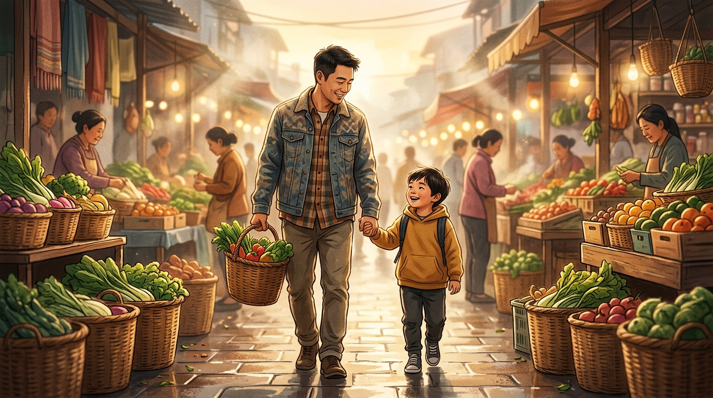

# 带孩子“见世面”，是普通家庭最贵的自欺欺人

每逢假期，朋友圈里总少不了一批“特种兵式”父母。

咬牙订两千一晚的亲子酒店，报动辄上万的网红研学营，在景区烈日下排队三小时打卡。发圈时的文案如出一辙：“趁着假期，带孩子出来见见世面。”

可一趟折腾下来，父母累得脱相、钱包缩水，回头问孩子记住了什么，往往让人哭笑不得：孩子最怀念的，是酒店里会唱歌的智能马桶，或是景区门口三十块一支的文创雪糕。

作家王朔曾一针见血地指出：
> **“很多父母所谓的带孩子见世面，无非就是带孩子去高级场所花钱，让孩子见识什么是高消费。”**

当“见世面”被简化成高消费打卡，不仅拓宽不了认知，反而是普通家庭最昂贵的一场自欺欺人。

---

### 01 只见消费不见生产，孩子看到的只有“价签”

商业社会最精明之处，就是把“感官刺激”包装成“教育投资”。

很多父母以为，住过豪华酒店、坐过头等舱，孩子就能自然拥有松弛感与大格局。

但残酷现实是：**消费场景展示的永远只是链条最光鲜的末端。**

大理石光亮如镜，服务生随叫随到，环境精心过滤掉了劳动的粗粝与生产的代价。孩子长期浸泡其中，不仅理解不了真实运转，反而会产生一种“便利理所当然、世界原本就是现成菜单”的被投喂错觉。

**只看消费的奢华，不看生产的代价，本质上是在提前培养一个被欲望绑架的纯消费者。**

---

### 02 真正的世面，是看清生活的真实骨架

如果高消费不是世面，普通家庭的孩子究竟该见什么样的世面？

**真正的世面，从来不是虚幻的浮华，而是看清现实的骨架与劳动的因果。**

比起在人挤人的乐园排队，不如在清晨四点半，带他去农贸批发市场看一看。看菜农怎样在晨光未起时卸下一筐筐带泥的蔬菜，看摊主怎样熟练过秤算账。

不如带他去物流转运中心外围看一看，让他明白手机里轻点“立即购买”，背后需要多少普通人彻夜奔波。

不如带他去父母工作的工位看一看，让他亲眼看看爸爸妈妈平时在怎样的电脑前熬夜、在怎样的柜台前赔笑。

**生产端不是更苦，而是更接近生活真相。** 亲眼见过真实的劳动与代价，孩子心底才会长出对生活的敬畏、对父母的共情与对金钱的分寸感。

---

### 03 见世面的终极目的，是长出一副抵抗浮躁的骨架

古人云：“见自己，见天地，见众生。”

所谓见世面，最终的落脚点是让孩子建立强大的内心秩序：

- **进殿堂时不自卑**：懂得那只是金钱购买的服务，无关人格高下；
- **入市井时不傲慢**：明白每一张钞票和每一粒粮食背后的沉甸甸汗水；
- **遇低谷时不脆弱**：因为早已看清世界的粗粝与真实，懂得带着约束踏实前行。

教育从来不是把孩子打扮得多体面，而是让他在褪去消费外衣后，依然拥有扎根大地的韧劲。

别再让虚荣和焦虑绑架家庭钱包。带孩子回到真实人间，看一看那些用力生活的人，才是普通家庭能给孩子最硬核的世面。

---

#带孩子见世面# #家庭教育# #育儿经# #认知提升# #中产焦虑# #生活真相#
