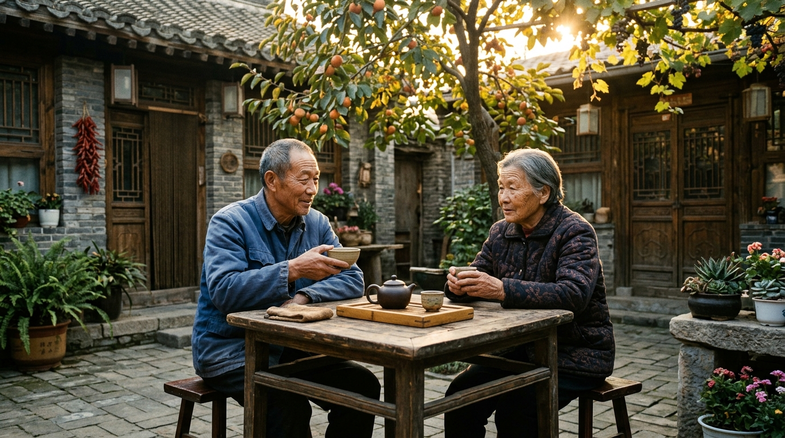

# 年少吃苦和老来吃苦，哪一个更苦？看透这三点不迷茫

在头条上看到一个破亿阅读的热门话题，戳中了千万读者的心窝子：年少吃苦和老来吃苦，究竟哪一个更苦？

有人觉得年轻时没钱没地位，四处碰壁最难熬；但真正上了年纪的人却明白，年少的苦根本不算苦，老来的苦才是真凄凉。

走过半生，算透人生的账本，其实无非是这三点现实：

第一，年少吃苦苦在皮肉，老来吃苦苦在心神。年轻时多干点苦活、熬点夜、吃几口泡面，睡一觉体力就能回满。摔了跟头，爬起来拍拍灰，未来还有几十年可以翻盘；可人一旦老了，满头白发、手脚迟钝，稍有个头疼脑热就得卧床不起，那份无力感直接渗进骨髓里。

第二，年少吃苦有人帮衬，老来吃苦无人可依。年轻时手头紧，父母总会想方设法垫一口热饭，身边还有同甘共苦的朋友；到了晚年，父母早已不在，同龄老友各自抱恙，久病床前更是考验人性。卡里要是没有碎银，连买盒降压药都要看儿女脸色，尊严荡然无存。

第三，年少吃苦是在筑堤，老来吃苦是在决堤。年轻时多吃一点学习的苦、攒钱的苦、克制欲望的苦，都是在给未来的风雨筑一道坚固的堤坝；要是前半生贪图安逸、盲目挥霍，到了晚年风雨袭来，就只能眼睁睁看着生活溃决。

生活很残酷，苦难总得挑一头吃。在能打拼的年纪多吃一点有价值的苦，存好手里的积蓄，爱惜自己的身体，才是给后半生攒下最硬的底气。

---

#年少吃苦和年老吃苦,哪一个更苦?# #生活感悟# #人到晚年# #后半辈子# #真实生活#
