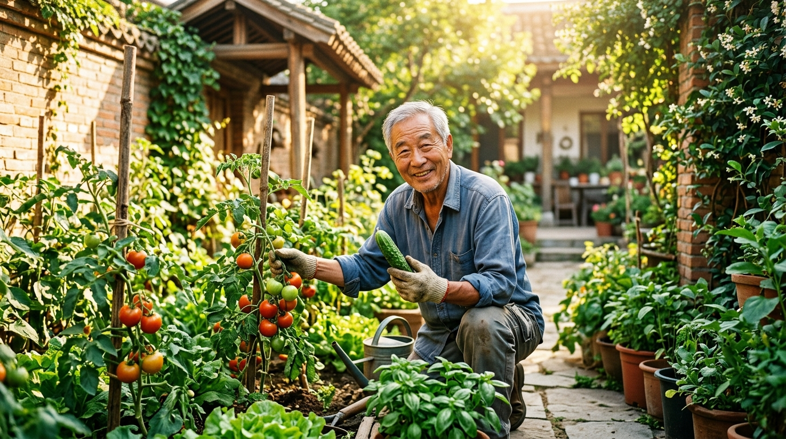

# 老了什么是你的底气？其实就这九个字

这两天头条上一个超3亿阅读的热门话题，戳中了无数普通人的心窝子：人老了，到底什么是你的底气？

有人说底气是银行卡里存够几百万，有人说底气是养出有出息的儿女。但在十几万条充满人间烟火的真实留言里，最打动我的，却是一位网友分享的身边对比：

他三姨存款两百万，独子定居海外，老伴走了三年，两百平的大房子里冷冷清清，深夜常常整宿失眠；而他父亲退休金不到三千，在老家院子里种满黄瓜茄子，谁路过都热情地塞上两根，街坊包了热饺子也会端来一盘。老头整天乐呵呵的，逢人就笑笑：“够吃，挺好”。

你看，人这一辈子忙忙碌碌，真到了晚年，最大的底气从来不是给外人看的排场，更不是账本上冰冷的数字，其实就藏在九个字里：

第一，没大病。能自己买菜、烧饭、下楼遛弯，能把自己的生活起居料理得干干净净。不躺在病床上折磨自己，也不给原本就不容易的儿女添负担，身体能自理，就是晚年最大的福报。

第二，有碎银。不指望儿女接济，不用伸手看人脸色过日子。哪怕按月只有两三千的退休金，只要不盲目折腾，一茶一饭吃得踏踏实实，花自己卡里的钱，心里才最硬气。

第三，有人陪。兜里再有钱，要是身边连个说话的人都没有，日子该有多冰冷；身边有老伴能斗斗嘴，有一两个老友能下棋喝茶，出门有街坊打招呼，有地方去、有家可回，晚年的日子才算真正热气腾腾。

年轻时总以为底气是征服世界、赚大钱；走过大半生才彻底想通，最体面的晚年，其实无非就是这九个字：没大病、有碎银、有人陪。

---

#老了什么是你的底气# #生活感悟# #人到晚年# #退休生活# #心态决定一切#
