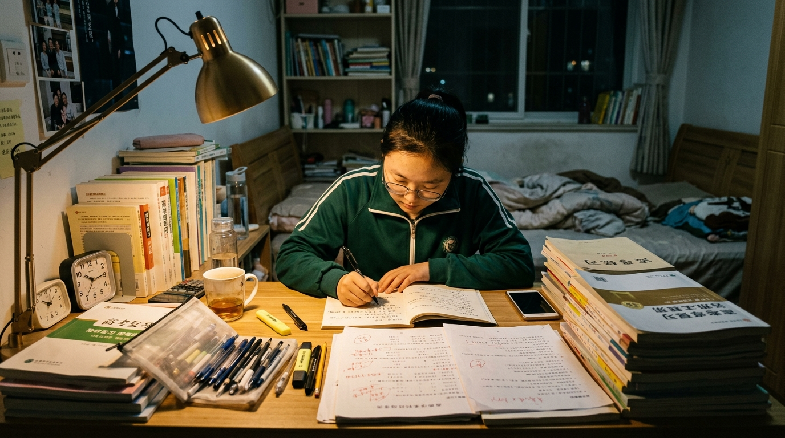

# 如果真取消了高考，普通人拿什么拼？

网络上隔三差五就有人跳出来，喊着要“取消高考”。理由无非是千篇一律的陈词滥调：应试教育扼杀学生天性，千军万马过独木桥太苦，把年轻一代逼得喘不过气。

不少家长跟着盲目附和，以为只要取消高考，孩子就能卸下重担、快乐成才。这种念头看似体贴温情，实则是看不清社会真相的糊涂。

高考确实残酷，每年放榜都伴随着无尽的焦虑。但大家必须承认一个最根本的底线：它依然是目前中国最公平、最坚固的一块上升基石。

在考卷面前，分数从来不看家庭背景，不问父母职务。不管你是偏远山村的孩子，还是普通工薪的后代，坐在密封的考场里，所有人面对的都是同一样的规则。

如果真的顺应呼声取消了高考，社会对人才的筛选需求难道会凭空消失吗？绝不可能。空出来的评价标准，只会迅速滑向家庭财富与人脉资源的隐秘博弈。

高收入群体随时能给孩子包装出高雅特长、马术证书，甚至用真金白银堆出科研专利与海外研学背景。普通家庭的孩子，拿什么去跟别人拼这些昂贵的“综合素质”？

拆掉一张公开透明的高考试卷，不仅换不来减负，反而会彻底封死普通人向上流动的通道。唯分数论固然有局限，但分数面前人人平等，却是普通家庭握在手里最硬的盾牌。

把手里的盾牌主动扔掉，去盲目相信不切实际的温情谎言，最后吃亏的只能是老实人。守住高考的底线，就是守住千千万万普通家庭翻身的希望。

---

#应该取消高考吗# #教育思考# #高考观察# #现实生活#
