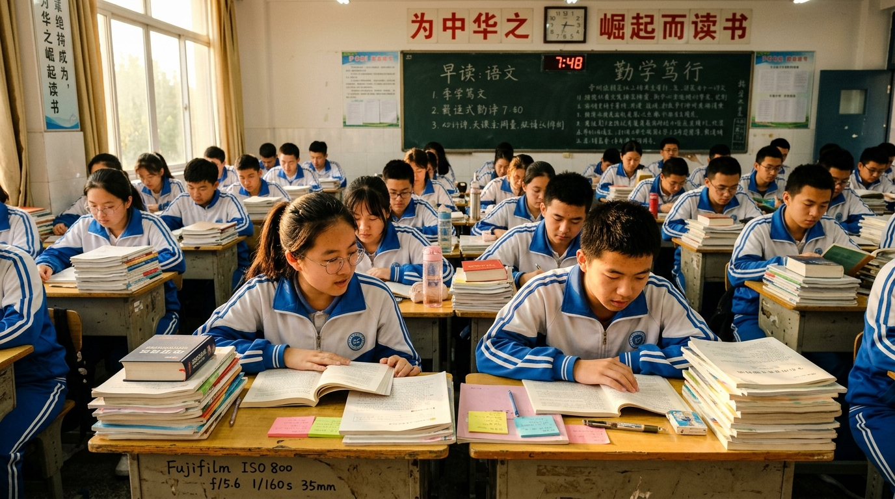

# 高考若取消英语，普通家庭只会更难

网络上总有一帮人呼吁把英语踢出高考，理由无非是“平时用不上”、“学得太痛苦”。很多人跟着盲目附和，以为减了负就能轻松翻身。这种想法太天真。高考不考英语，社会对英语能力的需求就会凭空消失吗？核心算法、前沿论文、涉外经贸、甚至高薪外企的技术文档，哪一样能离开英语？社会的真实选拔标准明摆在那里，闭上眼睛装看不见，最后吃亏的只能是普通人。

英语留在高考里，公立学校就必须按教学大纲认认真真教。普通家庭的孩子坐在公立教室里，靠着几块钱的课本和老师的板书，就能和所有人站在同一张考卷面前竞争。一旦高考取消英语，公立教育必然顺理成章地边缘化这门课。高收入群体根本不在乎，他们可以花重金请一对一口语私教，买昂贵的原版教材，甚至直接把孩子送进双语私立学校。普通家庭的孩子呢？没了公立学校兜底，他们连系统掌握这门核心工具的低成本通道都被彻底切断了。

把英语移出高考，不是消除了差距，而是把原本公开透明的考场竞争，变成拼家庭财力的暗箱较量。通向高处的台阶没有减少，只是公立的免费楼梯被拆掉了，只留下一部收费高昂的观光电梯。所谓的“减负”，不过是用虚假的轻松麻痹普通人，顺带把竞争壁垒筑得更高。真正的教育公平，是给每个普通孩子发一把能上战场的武器，而不是哄骗他们主动缴械，去相信童话。认清现实的残酷，抓紧手中的工具，远比躺在空想里更能守护孩子的未来。

---

#你认为高考应该取消英语吗# #教育思考# #高考改革# #现实观察#
