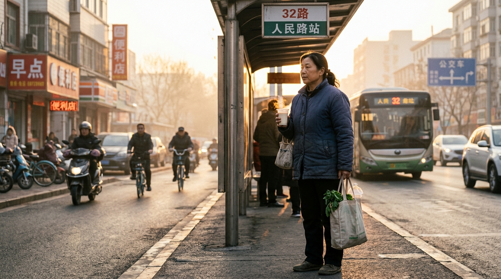

# 谁不知道健康重要，普通人只是在硬撑

网上总有人劝大家看开点，说什么身体是一切的前提，没必要为碎银几两拼命。这些话听着很有道理，可常常让人心里泛起一阵酸楚。

世上又有哪一个起早贪黑、深夜还在路上奔波的人，会不知道健康金贵呢？大家不是不懂生活的大道理，只是肩膀上扛着一家老小的温饱，身后退无可退。

房贷车贷按月要扣，孩子的学杂费开学就要交，老人的降压药按时得去开。停下一天工，账本上的数字就要见底，哪敢轻易停下脚步去歇一歇。

很多普通人平时头疼脑热，总是习惯在抽屉里翻两粒止痛药咽下去，咬咬牙继续上工。嘴上说着小毛病不碍事，心里其实是心疼去医院开销太大。

菜市场里挑挑拣拣，买菜总挑特价处理的，一件衣服洗得发白也舍不得扔。可在给孩子交补习费、给父母打生活费时，却从来没有半点犹豫迟疑。

在外奔波的人，受了委屈把眼泪往肚子里咽，累得直不起腰也只在车里坐两分钟。这哪是贪财，分明是为人父母、为人子女那份不敢倒下的本能。

可人终究是一副血肉之躯，不是不知疲倦的铁打零件。生活就算再难，也经不起一场毫无防备的重病，一张薄薄的单据足够压垮全家的安稳。

在这个用尽全力生活的年纪，多心疼一下疲惫的自己。少熬一次夜，按时吃上一口热饭，稍微放慢一点赶路的脚步，天不会塌下来。

健康的你，才是一家老小遮风挡雨真正的屋檐。你平平安安地陪伴在家人身边，才是这个普通家庭在漫长岁月里最硬的底气。

---

#人活一辈子，金钱，健康，哪个重要# #生活感悟# #凡人微光# #真实生活#
